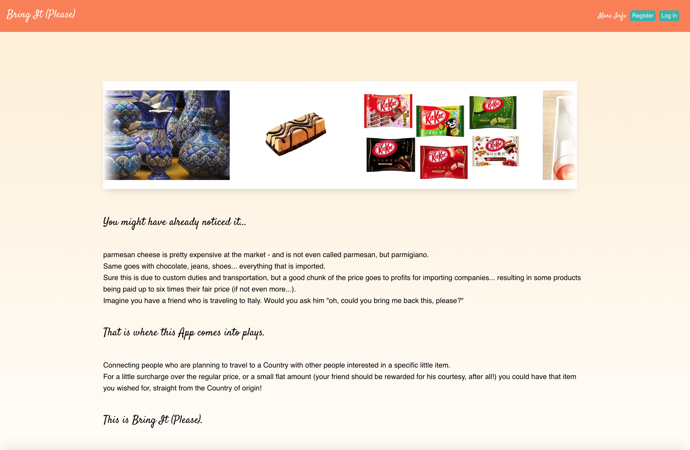
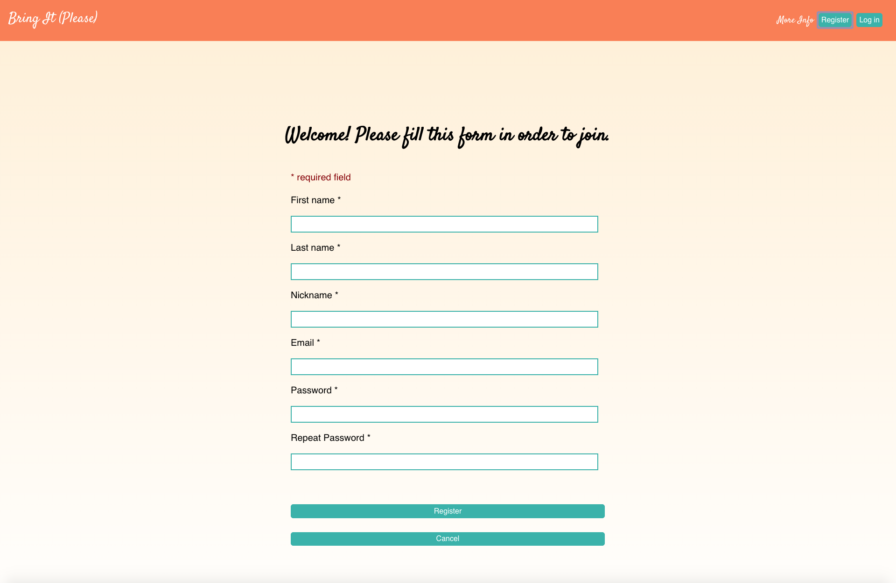
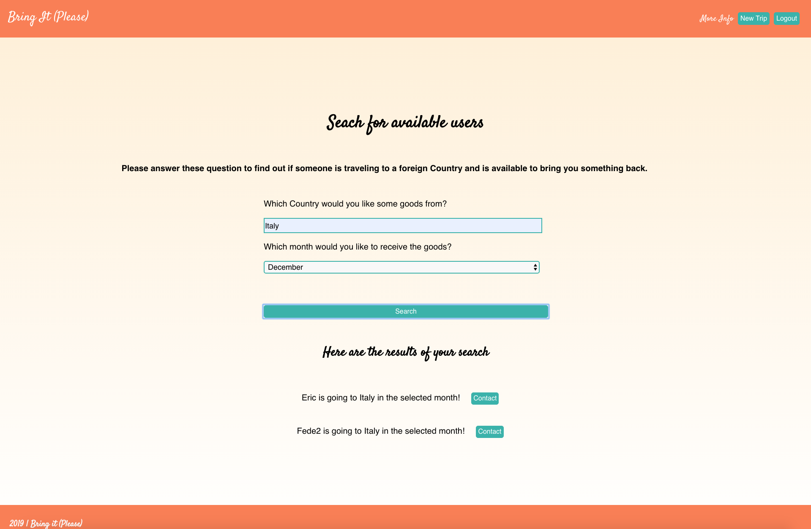

This project was bootstrapped with [Create React App](https://github.com/facebook/create-react-app).

## Welcome to Bring it (Please)
This app has been created using React, Node.js and PostgreSQL.

It's a social media where you can find and contact other people in order to ask them to "bring you something" from their trips abroad.

You must be registered and comply to the *Code of counduct* in order to access the community.

___

Link to the Live app: 

### https://fedecolap-bring-it-app.now.sh

___

If you want to explore the app, please use these credentials: 
#### DEMO-USER

#### Nickname: Eric

#### Password: G0d0dpassw0rd24!

If you want to see at least one result, please search for users traveling to Italy in the month of December

___

### Screenshots

